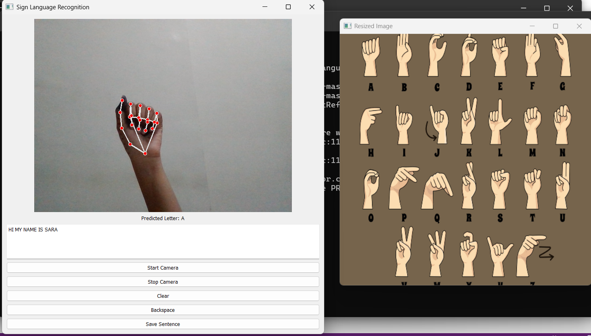
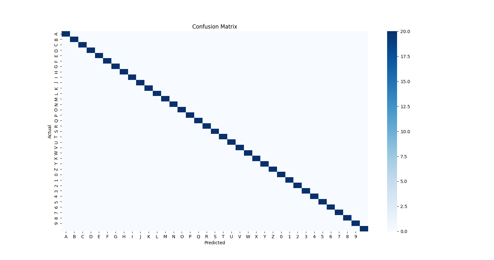

# Sign Language Interpreter — v2

Real-time recognition of the ASL alphabet (A–Z), digits (0–9), and space, from a live webcam feed — using MediaPipe hand-landmark extraction and a Random Forest classifier, wrapped in a PyQt5 desktop app that builds recognized letters into full sentences.

This is the upgrade of [Sign Language Interpreter v1](https://github.com/sarasayed7/sign-language-v1) (YOLOv5-based, 6 gestures), built as a final year engineering project at the University of Mumbai. Full methodology and results are documented in the accompanying research paper and final year report.



## How it works

1. **`src/collect_imgs.py`** — captures a labeled dataset via webcam (100 images × 37 classes)
2. **`src/create_dataset.py`** — runs MediaPipe over the images, extracts 21 hand landmarks per frame, normalizes coordinates, saves feature vectors to `data.pickle`
3. **`src/train_classifier.py`** — trains a Random Forest Classifier on an 80/20 split, saves the model to `model.p`
4. **`src/evaluate_model.py`** — generates the confusion matrix and classification report
5. **`src/inference_classifier.py`** / **`src/append_letters.py`** — CLI demos: live prediction with bounding box overlay; the latter also builds a running sentence with debounce logic
6. **`gui/PyQt5_GUI.py`** — the full desktop app: live video + landmark overlay, predicted letter, running sentence, backspace/clear/save controls
7. **`gui/PyQt5_GUI_variant_image_upload.py`** — a variant of the same app with a larger window and an added "upload image" option for testing on static images

## Results (final year report, held-out test set)

| Metric | Value |
|---|---|
| Accuracy | 94.7% |
| Precision | 93.5% |
| Recall | 92.8% |
| F1-score | 93.1% |



## Tech stack

Python · MediaPipe · scikit-learn (Random Forest) · OpenCV · PyQt5 · NumPy · Matplotlib / Seaborn (evaluation)

## Setup

```bash
git clone https://github.com/sarasayed7/sign-language-v2.git
cd sign-language-v2
pip install -r requirements.txt

# run the desktop app (uses the pre-trained model in model/)
python gui/PyQt5_GUI.py

# or the CLI demo
python src/append_letters.py
```

To retrain from scratch instead of using the included model:
```bash
python src/collect_imgs.py       # collect your own dataset into data/
python src/create_dataset.py     # build data.pickle from data/
python src/train_classifier.py   # train and save model.p
python src/evaluate_model.py     # generate confusion matrix
```

## Repo structure

```
sign-language-v2/
├── src/          # data collection, feature extraction, training, evaluation, CLI inference
├── gui/          # PyQt5 desktop application (main + image-upload variant)
├── utils/        # small dev/debug scripts (e.g. camera check)
├── model/        # pre-trained model.p and data.pickle
├── demo/         # confusion matrix, GUI screenshot, sample sentence outputs
├── LICENSE
└── requirements.txt
```

## Sample output

The `demo/sample_outputs/` folder has real sentences built letter-by-letter through the live GUI, e.g. `"SARA SAYED SHAUKAT HUSSAIN"` and `"HI MY NAME IS SARA"`.

## Attribution

The initial data-collection → landmark-extraction → Random Forest pipeline (`collect_imgs.py`, `create_dataset.py`, `train_classifier.py`, `inference_classifier.py`) was adapted from an MIT-licensed open-source tutorial by [computervisioneng](https://github.com/computervisioneng/sign-language-detector-python). Everything from `evaluate_model.py`, `append_letters.py`, and the full PyQt5 GUI application onward is original work built on top of that base, expanding it from a CLI proof-of-concept into a complete, GUI-driven, sentence-building application evaluated as a final year engineering project. See `LICENSE` for the original terms.

## Paper

Research paper: *Sign Language Recognition* — covers this system in full, including the literature comparison against wearable-sensor and deep-learning approaches.
Authors: S. Sayed, S. Shaikh, M. M. Shaikh, M. A. Shaikh.

## Team

Built with Sadiya Shaikh, Muhammed Muiz Shaikh, and Mohammad Amin Shaikh at Anjuman-I-Islam's Kalsekar Technical Campus.
